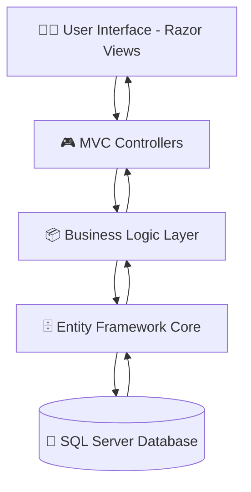
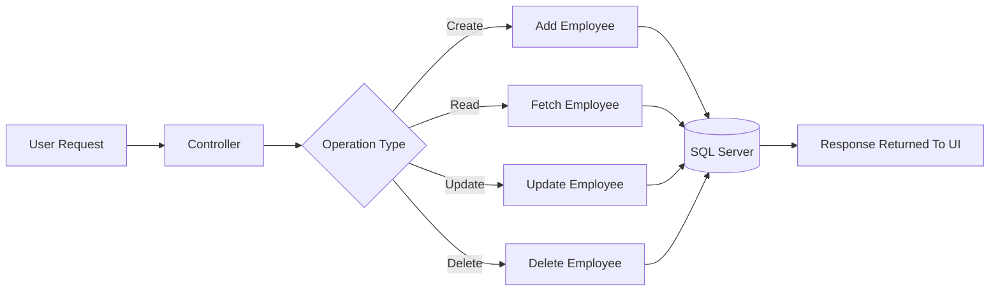
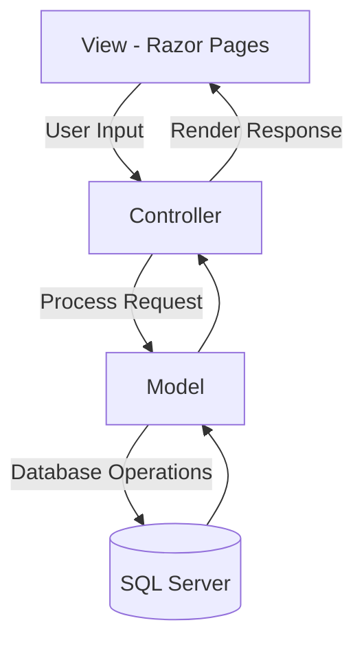

# 🚀 Smart Employee Management System

A modern Employee Management System built using **ASP.NET Core MVC** and **Entity Framework Core**.  
This application helps organizations efficiently manage employee records, departments, and employee-related information through a clean and responsive web interface.

---

## 📌 Features

- ✅ Employee CRUD Operations
- ✅ Department Management
- ✅ Master-Details Form Handling
- ✅ Entity Framework Core Integration
- ✅ SQL Server Database Support
- ✅ Responsive Bootstrap UI
- ✅ Razor Views & MVC Architecture
- ✅ Server-side & Client-side Validation
- ✅ Clean Folder Structure
- ✅ Stored Procedure Integration
- ✅ LINQ Queries & Data Handling

---

## 🛠️ Tech Stack

| Technology | Usage |
|------------|-------|
| ASP.NET Core MVC | Backend Framework |
| Entity Framework Core | ORM |
| SQL Server / LocalDB | Database |
| Razor Views | Frontend Rendering |
| Bootstrap 5 | UI Design |
| LINQ | Data Querying |
| jQuery Validation | Form Validation |

---

# 🧱 Architecture Diagram



---

# 🔄 Employee CRUD Workflow



---

# 🏗️ MVC Architecture Overview


# 📂 Project Structure

```text
📦 Smart-Employee-Management-System
┣ 📁 Controllers
┣ 📁 Models
┣ 📁 Views
┃ ┣ 📁 Employee
┃ ┗ 📁 Shared
┣ 📁 Data
┣ 📁 Migrations
┣ 📁 wwwroot
┣ 📜 Program.cs
┣ 📜 appsettings.json
┗ 📜 README.md
```

---

# ⚙️ Getting Started

## ✅ Prerequisites

Before running this project, make sure you have installed:

- .NET 8 SDK
- Visual Studio 2022
- SQL Server / LocalDB

---

# 🔧 Installation

## 1️⃣ Clone Repository

```bash
git clone https://github.com/YOUR_USERNAME/smart-employee-management-system.git
```

---

## 2️⃣ Navigate To Project Folder

```bash
cd smart-employee-management-system
```

---

## 3️⃣ Configure Database

Open:

```text
appsettings.json
```

Update your SQL Server connection string:

```json
"ConnectionStrings": {
  "DefaultConnection": "Server=YOUR_SERVER;Database=EmployeeDB;Trusted_Connection=True;TrustServerCertificate=True;"
}
```

---

## 4️⃣ Apply Migrations

```bash
dotnet ef database update
```

---

## 5️⃣ Run Application

```bash
dotnet run
```

---

# 🧪 Validation Features

- Server-side validation using Data Annotations
- Client-side validation using jQuery Validation
- Bootstrap form feedback integration

---

# 📸 Future Improvements

- 🔹 Role-Based Authentication
- 🔹 Attendance Management
- 🔹 Employee Profile Upload
- 🔹 Dashboard Analytics
- 🔹 Export Reports to PDF/Excel
- 🔹 Email Notifications

---

# 🎯 Learning Outcomes

This project helped in understanding:

- ASP.NET Core MVC Architecture
- CRUD Operations
- Entity Framework Core
- Database Relationships
- Form Validation
- Razor View Engine
- SQL Server Integration

---

# 🤝 Contributing

Contributions, suggestions, and improvements are welcome.

Feel free to fork this repository and submit pull requests.

---

# 📄 License

This project is licensed under the MIT License.

---

# 👨‍💻 Author

Developed with ❤️ by **Priyanshu Patidar**
